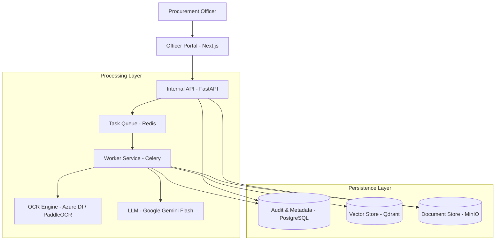

# TenderEval Platform
### Clinical Precision in Procurement Evaluation

TenderEval is an AI-driven platform designed to modernize the government procurement process for the Central Reserve Police Force (CRPF). It transforms the manual, inconsistent, and audit-heavy task of tender evaluation into a streamlined, transparent, and legally defensible digital workflow.

---

## The Innovative Solution: Audit-First AI

Unlike generic document parsing tools, TenderEval is built on a Structured, Explainable AI architecture. Procurement is a legally binding process where accuracy is a requirement rather than a metric.

### 1. Deterministic vs. Probabilistic Reasoning
The system addresses the risk of AI hallucination by bifurcating the evaluation logic:
- **Probabilistic (AI):** Leveraged for semantic matching and interpreting qualitative criteria (e.g., "satisfactory performance history").
- **Deterministic (Rule Engine):** Numeric thresholds (turnover, net worth) and date arithmetic are executed by a standard Python rule engine. The AI extracts the raw values, while the engine performs the verification.

### 2. Immutable Hash-Chained Audit Trail
Every system verdict and officer action is recorded in a SHA-256 hash-chained log. This tamper-evident architecture ensures the integrity of the procurement record, providing a defensible trail for legal or administrative scrutiny.

### 3. Clinical Precision Design System
The user interface utilizes a glassmorphic, expert-grade design system. This approach minimizes cognitive load for procurement officers while maintaining high information density, facilitating rapid side-by-side evidence verification.

---

## System Architecture

---

## Key Features

### Automated Criteria Extraction
Powered by Google Gemini-Flash, the system automatically parses extensive tender documents to identify financial, technical, and compliance requirements, mapping them to structured JSON schemas for evaluation.

### Multi-Engine OCR Pipeline
Handles diverse document qualities and formats:
- **Azure Document Intelligence:** For complex layouts and financial tables.
- **PaddleOCR:** Specialized for Hindi and regional language text extraction.
- **Tesseract 5:** Utilized for high-speed fallback.
- *Supports scanned PDFs, photographs, hand-signed certificates, and official stamps.*

### Hybrid Retrieval Engine
Employs Reciprocal Rank Fusion (RRF) to combine:
- **Dense Vector Embeddings:** For semantic, context-aware matching.
- **BM25 Search:** For exact keyword matches (e.g., GSTIN, PAN, ISO certification codes).

### Human-in-the-Loop Verdict Logic
- **PASS/FAIL:** Automated verdicts for high-confidence matches.
- **NEEDS_REVIEW:** A safety mechanism that routes low-confidence OCR, missing evidence, or ambiguous language to an officer's dashboard. Missing evidence never triggers an automatic failure.

### Interactive Review Dashboard
Provides a side-by-side viewer highlighting exact evidence locations within bidder documents, enabling officers to Accept, Override, or Request Clarification.

---

## Technology Stack

| Layer | Technology |
|---|---|
| **Frontend** | Next.js 14, TailwindCSS, Framer Motion |
| **Backend** | FastAPI (Python 3.11) |
| **AI/LLM** | Google Gemini (Flash-latest), LangChain |
| **Database** | PostgreSQL (Metadata/Audit), Qdrant (Vector Store) |
| **Async Tasks** | Celery + Redis |
| **Storage** | MinIO (S3-compatible document store) |

---

## Future Features and Enhancements

### 1. Real-Time External Verification
Integration with government APIs (GSTN, MCA21, and EPF/ESIC) to perform real-time verification of bidder credentials, reducing reliance on uploaded PDF certificates.

### 2. Multi-Officer Consensus Engine
A collaborative evaluation module allowing multiple officers to vote on "Needs Review" cases, with weighted consensus logic for high-value procurement decisions.

### 3. Predictive Performance Scoring
Leveraging historical procurement data to generate risk scores for bidders based on past project delivery timelines and quality compliance.

### 4. Automated Clarification Bot
An automated communication layer that generates and sends clarification requests to bidders for missing or blurry documents, tracking responses within the audit log.

### 5. Advanced Financial Table Analysis
Implementation of Vision-LLMs (Gemini Pro Vision) to handle extremely complex, multi-page financial balance sheets with sub-total verification.

---

## Safety and Compliance Rules

1. **Safety First:** Missing evidence must never automatically fail a bidder; it must be routed to `NEEDS_REVIEW`.
2. **Confidence Thresholds:** OCR confidence scores below 0.70 are automatically flagged for manual verification.
3. **Deterministic Logic:** All numeric and date comparisons are handled by code, not LLM inference, to prevent arithmetic errors.
4. **Append-Only Logging:** All system and user interactions are immutable and cryptographically linked.

---

## Local Development Setup

### Prerequisites
- Docker and Docker Compose
- Node.js and pnpm
- Python 3.11 or higher
- Google Gemini API Key

### Deployment Steps
1. **Infrastructure:** Execute `docker compose up -d` to start PostgreSQL, Redis, MinIO, and Qdrant.
2. **Frontend:** Run `pnpm install` followed by `pnpm dev`.
3. **Backend Services:**
   - API: `uvicorn app.main:app --reload` (within `services/api`)
   - Worker: `celery -A worker.celery_app worker` (within `services/worker`)

---

*Prepared for CRPF Theme 3 — AI-Based Tender Evaluation and Eligibility Analysis.*

